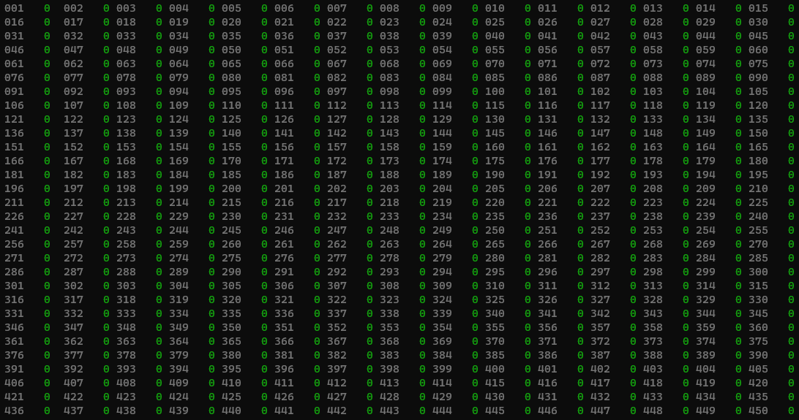

# Config Utility

### Download

Download the latest version of the Config Utility from [here](https://github.com/DMXCore/Pico2ReMapper-Public/releases). We provide binaries for both Windows and Mac OSX. Note that the current version of the config utility is text-based.


#### Start the application

You start the application by just double-clicking `DmxRemapperConfig.exe` on your Windows machine (currently only supporting Windows 64-bit, more platforms coming later).

The Config Utility is a simple text-based menu-driven application that interacts directly with the Pico2 Re-Mapper.

When launched it will iterate through all serial ports on your computer and query for the Re-Mapper firmware. Once found it will say: `Found Pico device, serial ******** on port COM**`.

The menu options are:

* Read DMX
* Get Mapping
* Modify Mapping
* Revert Mapping
* Write Mapping to Flash
* Write Mapping to local file
* Read Mapping from local file
* Reset Mapping
* Read Status
* Quit

### Menu options

#### Read DMX

Reads the last received DMX frame from DMX port A and outputs it on the screen. The channel number (1-512) is in gray and the current value (0-255) is in green.\


#### Get Mapping

Reads the current running mapping from the Re-Mapper. Note that this doesn't necessarily match what is stored in its flash memory, as you modify the mapping it's only in volatile RAM until you write it to the flash storage. Get Mapping will read what is currently in RAM.

#### Modify Mapping

This is where you can modify the mapping, one channel at a time. Selecting this option will prompt you which output channel you want to modify (1-512). Enter the number and then select if you want to map it to one of the input channels (1-512), or a fixed value, meaning it's always going to be set to the DMX value you enter (0-255). Once completed the mapping is immediately sent to the device and you should see the mapping on your DMX output. Note that it is only written to the device's RAM, if you want it to be permanent then you need to write it flash. This allows you to test different mappings without constantly overwriting the flash (which has a limit on number of writes, but it's in the 1000s range, if not 10,000s).

#### Revert Mapping

This option will re-read what is in the flash memory on the device into the RAM. Same as would happen during power-cycle. Any mapping you had modified in RAM would be lost.

#### Write Mapping to Flash

Selecting this option will write the current mapping (as it's currently residing in RAM) onto the device flash memory. This makes it permanent and will be loaded when the device boots up after power cycle.

#### Write Mapping to local file

This option will take the current mapping and write it onto a file on your PC. The file will be called `Mapping_*******.yaml` and will be overwritten if it already exists. The \*\*\*\* part is the serial number of the device, which is always unique. The file can be opened with a standard text editor for bulk changes. You can also stores these files if you manage multiple sites. The file format is basically a list of all output channels, followed by a string that is either `input-***` for mapping that output to the specified (the \*\*\*-part) input channel, or `fixed-***` to set it to a fixed DMX value (0-255).

Example partial file:

```yaml
configVersion: 1.0
output:
  1: input-1
  2: input-2
  3: input-3
  4: input-4
  5: fixed-5
  6: input-6
  7: input-7
  8: input-8
  9: input-9
  10: input-10
...
```

#### Read Mapping from local file

This will list all `*.yaml` files in the current directory and allow you to select which file to use. It's then read into the Re-Mapper device and you should see the mapping immediately on the output. Remember to write to flash if you want it to be permanent.

#### Reset Mapping

Resets the mapping (in RAM) to map 1:1 from the input to the output.

#### Read Status

Displays details about the current input DMX stream, how many frames have been received since power cycle, and what the frame rate currently is (based on reads from last second).

#### Quit

Quits the application. You can also just close the application, or unplug the device.

