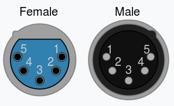

# Pin out

### DMX pin out

* G - `Ground/Common` - pin 1
* A - `Data+` - pin 3
* B - `Data-` - pin 2

<figure><figcaption>
XLR-3
</figcaption></figure> <figure><figcaption>
XLR-5
</figcaption></figure>

