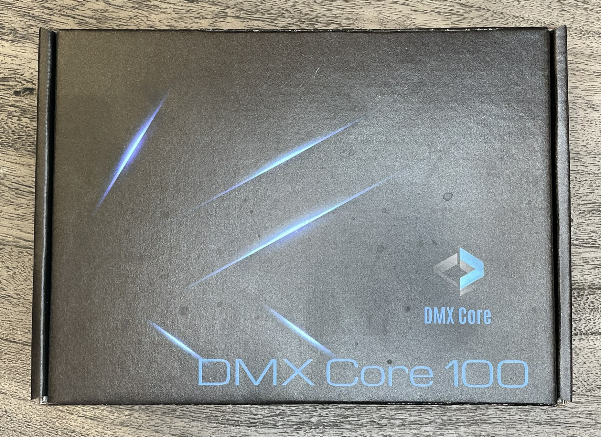
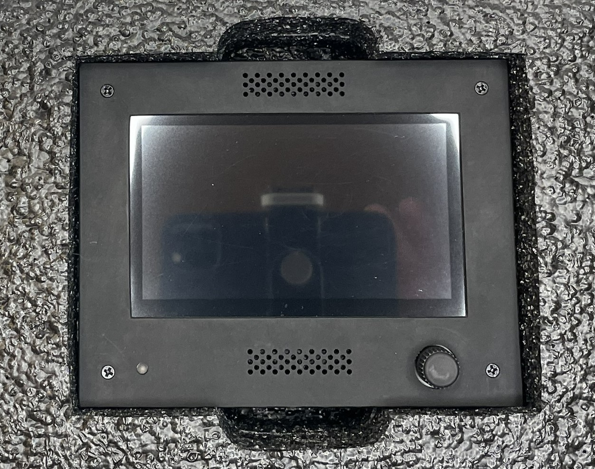
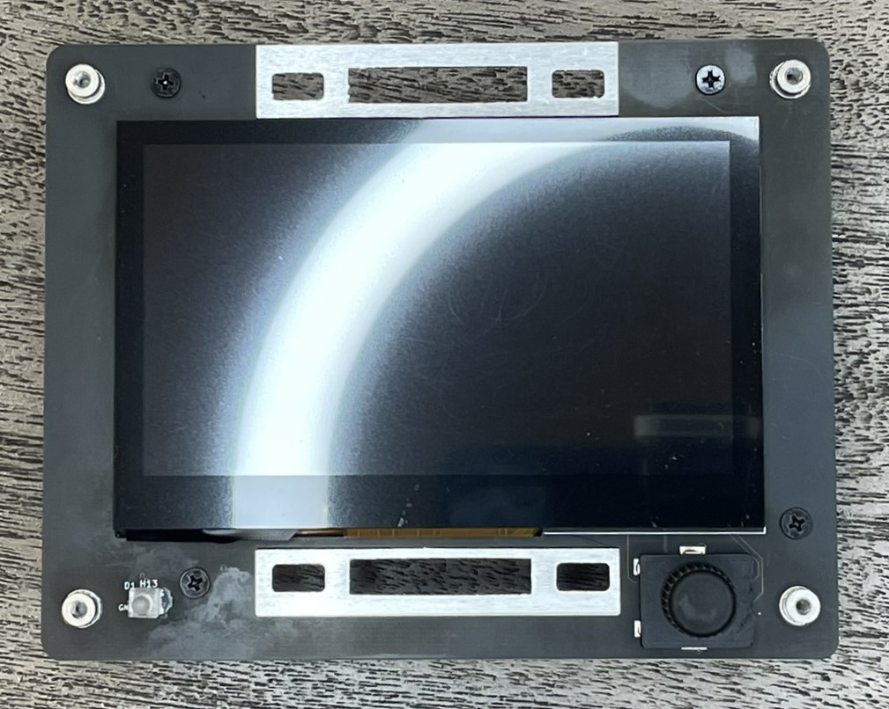
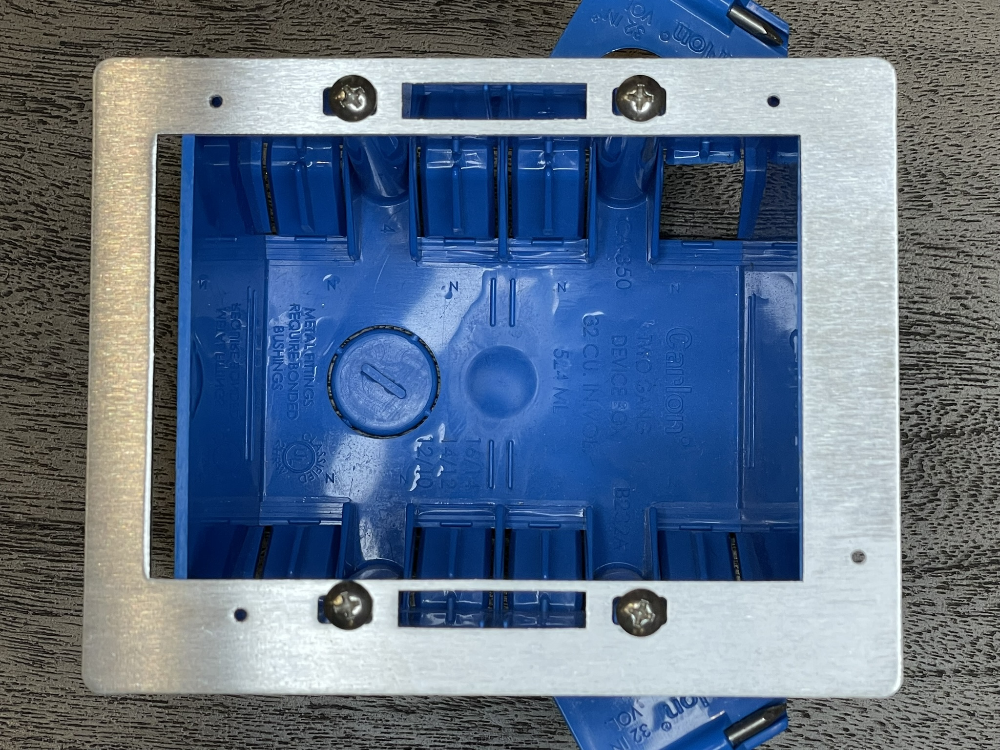
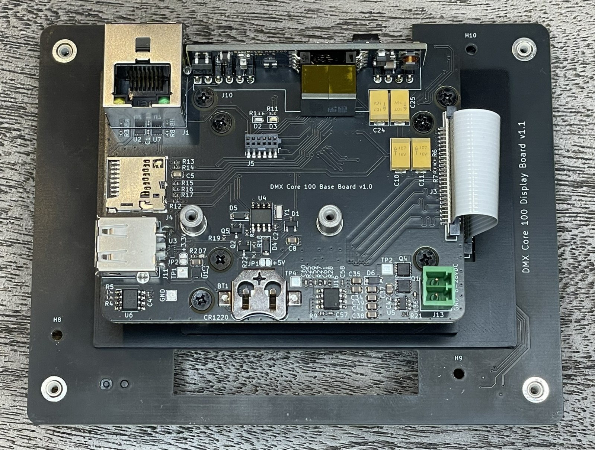
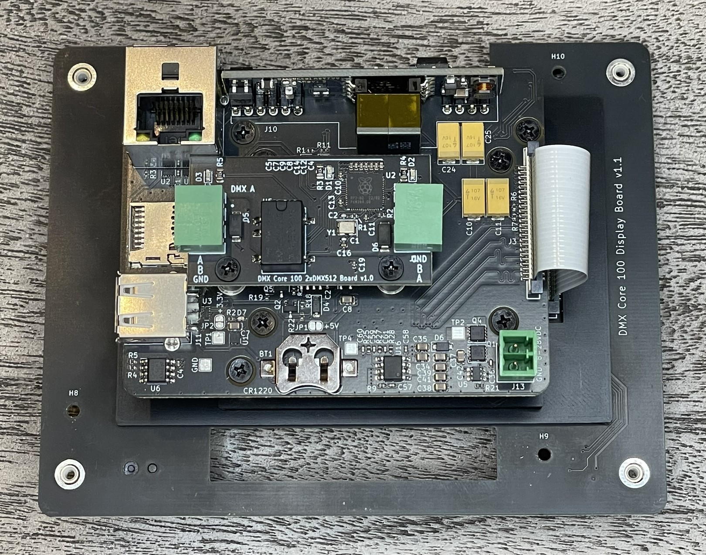

# Installation

The DMX Core 100 is designed to fit into a standard 2-gang electrical box and can be powered either by Power Over Ethernet, or with a 8-28VDC power supply (not included).

#### Parts

The DMX Core 100 is delivered in a padded box with:

* Main unit with attached touch screen
* Aluminum mounting bracket
* 4 screws to attach bracket to a standard electrical box
* 4 flat screws to attach the main unit to the aluminum bracket
* 4 countersunk black screws to attach the bezel to the main unit
* Black bezel/frame
* 2-port DMX512 board, if ordered

#### Unboxing

The DMX Core 100 is shipped in a box with padded protective foam.

<figure><figcaption>
DMX Core 100 Box
</figcaption></figure>

Open the box and carefully lift the DMX Core 100 at the top and bottom.

<figure><figcaption>
DMX Core 100 in padded box
</figcaption></figure>

You'll notice the four screws that hold the bezel in place. Unscrew these to remove the bezel. You can now see the rotary encoder (knob) to the right and the light pipe to the left used as an RGB indicator. Be careful with the light pipe when the bezel is removed as it's fragile (but can be replaced).

<figure><figcaption>
DMX Core 100 with bezel removed
</figcaption></figure>

The main unit is attached to the aluminum mounting bracket, remove those four screws as well. You can now attach the bracket to your electrical box. Make sure it's oriented correctly (note the screw holes where you just removed the screws). It is possible to mount the bracket with the main unit attached to the electrical box, but we don't recommend it as a slip of the screw driver may damage the screen (which isn't covered by the warranty). It's safer to mount the bracket first.

<figure><figcaption>
Electrical box with bracket mounted
</figcaption></figure>

#### Main unit

The main unit of the DMX Core 100 consists of the display board (with the touch screen), the base board and compute module (between the base and display boards) with its heat sink.

<figure><figcaption>
Back of the main unit. The DMX-512 board attach to the connector labeled J5 and the two screw spacers.
</figcaption></figure>

Here you'll see all the features of the rear of main unit:

* RJ45 for ethernet connection (1 GbE with PoE)
* PoE module
* Micro-SD card holder for additional storage
* USB-B for connecting memory stick, USB-DMX adapter, MIDI controller or loading the initial boatloader to the unit.
* 8-28VDC power connector (if not using PoE)
* Battery holder for an optional CR1220 battery used to power the RTC clock when disconnected from power and internet.
* Board-to-board connector for DMX-512 expansion board
* Flex cable that connects to the display board

#### Optional DMX-512 board

If you ordered the DMX Core 100 with the 2-port DMX-512 board then it will already be attached to your DMX Core 100. However if you need to remove it, or ordered it separately then this photo shows how it's attached to the back of the main unit.

Attach the DMX-512 board, align the board-to-board connector and press slightly all the way down. The screw holes should align with the spacers on the main unit. Secure the board with two flat pan-head screws (included).

<figure><figcaption>
DMX-512 board attached to DMX Core 100 main unit
</figcaption></figure>

#### Power Up

Attach the network cable, and optionally the power supply connection if you're not using PoE, to the back of the main unit. Verify that it powers up (LED on back of unit, it takes about a minute before the screen comes up) and then mount it into the electrical box/frame. Be careful when you mount it into the electrical box as the display is close to the mounting holes and if the screw driver slips it may damage the display and would not be covered under warranty.

#### Connectivity

We recommend that the DMX Core 100 is connected to the internet at all times, that way it will receive updates and the optional remote access feature will be available. It also allows the manufacturer to capture error logs and provide remote technical support. Note that the DMX Core 100 is security hardened and no inbound connections from the internet are open, and no ports are required to be opened in your router/firewall. The unit can operate completely stand-alone, however at a minimum we recommend that it's connected to the internet initially to receive the latest software release before deployment.

#### Heat

The PoE module and the main processor of the DMX Core 100 generates about 6-7 Watts of heat. With only passive cooling, when using PoE, make sure there are open vents in the electrical box where you install the DMX Core 100 if you use a plastic box, or use a metal box which will then help with heat dissipation. If possible, use a low-voltage open frame to allow heat to escape into the wall.
