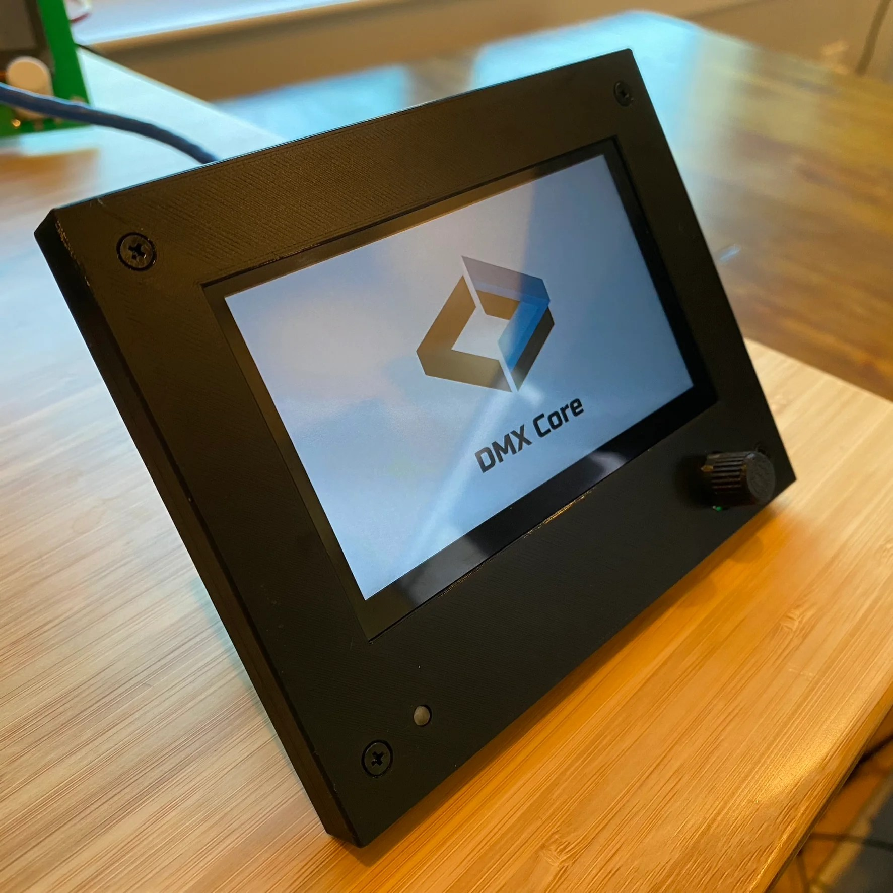

# Features

<figure><figcaption>
DMX Core 100 Wall Controller
</figcaption></figure>

### Main

* Record and playback of dynamic DMX, up to 200 universes
* Playback of WAV audio files via USB or onboard optional audio board
* Light fixture control with profiles
* Multi-room/zone support
* Presets with smooth fades
* Scheduler
* Remote control for QSys and Symetrix DSP cores
* Installer-customizable menu options
* Set up multiple units as remote control/server
* Map outputs to a combination of ArtNet/sACN/KiNet/DMX universes
* Support for optional 2-port DMX-512 board
* Record from any source (DMX-512, ArtNet sACN or KiNet), plus live monitor feature

### Security

* Three main modes of access; admin, user and lock-down
* Screen lock with 4-digit pin code
* Admin Web UI
* Lock-down mode prevents admin access via touch screen (only accessible via Web UI)
* Installer-configured custom menus with multiple levels and icons

### Hardware

* 4.3" touchscreen
* Powerful compute module based on Raspberry Pi CM4
* Knob to navigate without touching the screen, plus used for easy control input
* RTC clock with (optional) battery backup
* Power over Ethernet or 8-28VDC power input
* Uses max 8 watt of power
* Black bezel (3d-printed, STL files are available to customers)
* Aluminum mounting frame
* 1 GbE Ethernet, supporting up to 100 universes at 40 Hz for network streams
* MicroSD and USB-A for file storage/bootloader updating
* Supports USB DMX output via Enttec Pro/DMXking USB device (up to 4 universes)
* Supports 2-port DMX512 board via piggy-back connector
* Support Stereo Audio Playback via USB or audio interface board via piggy-back connector
* Designed to be installed in a 2-gang electrical box

### Administration

* Remote configuration via BalenaCloud (secure VPN access)
* Configure settings via Web UI and API
* Remote software upgrade (requires internet connectivity)
* Admin/User/Lockdown mode
* DHCP or Static IP configuration on device or Web UI
* Device nick name (displays on-screen)
* Device network host name override
* Time zone support
* Auto log-off of admin user
* Web Admin UI with features to view screenshot of the device, perform upgrades, view log file, restart and more
* VNC remote control to remotely operate the touch screen
* Backup/Restore to local files and cloud
* Custom menu for locked down device operation

### Lighting

* ArtNet, sACN (E1.31) and KiNet (v1 and v2) support up to 100 universes at 40 Hz
* Supports sync packets over ArtNet, sACN and KiNet for multi-universe sync
* Supports sACN send priority
* Support for USB devices (Enttec Pro and DMXking devices)
* Optional 2-port isolated DMX512 board (mounts at the back of the DMX Core 100)
* Trigger cues, playback, presets, dimmers and more via custom LUA script on QSC Q-Sys and Symetrix DSP cores
* Remote control via OSC (to be used with software like TouchOSC and more)
* Remote control via MIDI (trigger via pads and knobs on equipment like Akai LPD8 and others)
* Import light fixture profiles from [Lightkey ](https://www.lightkeyapp.com/en/fixtures)and [Daslight (SSL2)](https://store.daslight.com/en/ssl)
* Passthrough feature on DMX ports
* Fade in/out and cross-fade cues, including masking for DMX channels that shouldn't fade
* Bounce playback (play cues forward and backwards for simple seamless looping)
* Import cues from DMXking products and from [Pharos Controls DMX Recorder](https://www.pharoscontrols.com/support/designer/software-downloads/#dmx-record)

### External Control

* Build custom UI for external controllers like QSC/Q-Sys and Symetrix
* Up to 4 columns of controls based on a mix of buttons and faders
* Control multiple levels on single fader (switch between rooms/zones)
* Program push knob to control mute or switch level zones
* Two-way updates, see the current status and levels on all connected devices
* Compatible with Q-Sys from QSC and the Symetrix SymNet DSPs
* Uses built-in control interface of QSys and Symetrix, no scripting or extra licenses required
* Customize buttons, icons and colors
* Support multiple pages, accessible via custom menus
* Remote management via Web Admin UI and VNC
* Dynamic reload when configuration updated, completely remotely

### Customization

* Build customized menus for end-user control
* Replace home screen logo, backgrounds and icons
* Develop custom menus from Web UI and see the result on the touch screen
* Set custom properties on cue playback in menus like fade in/out, loop counts
* Supports multiple levels, header logo and much more

